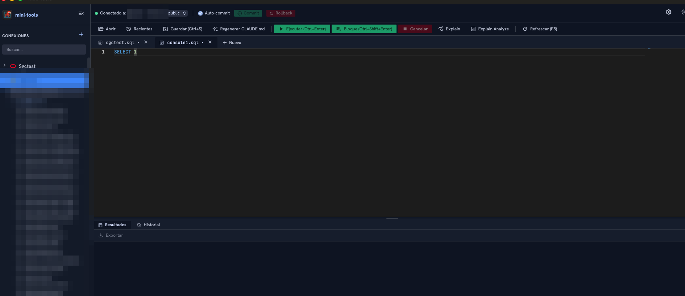
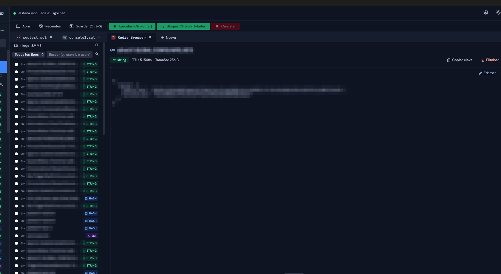
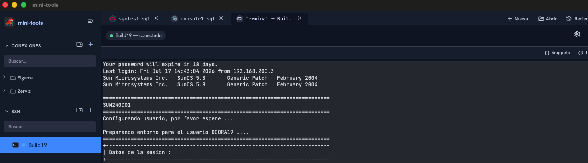
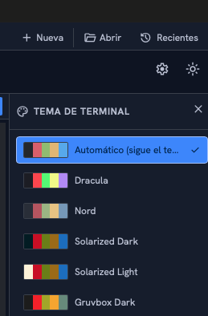
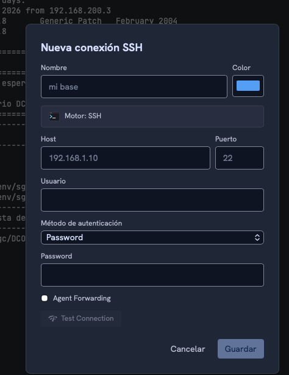
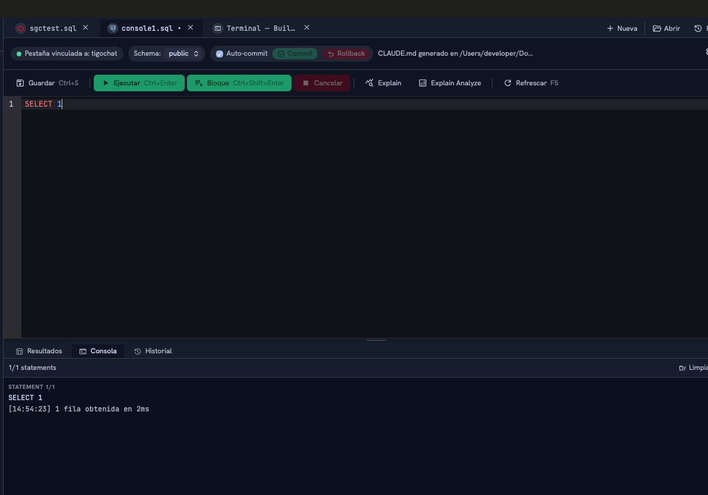
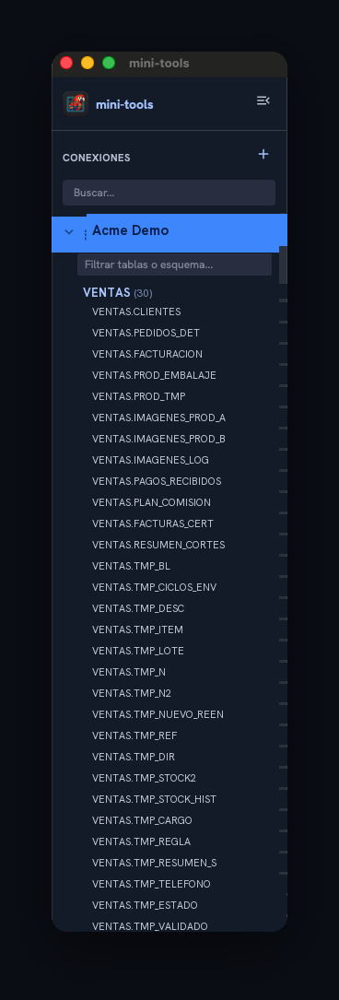
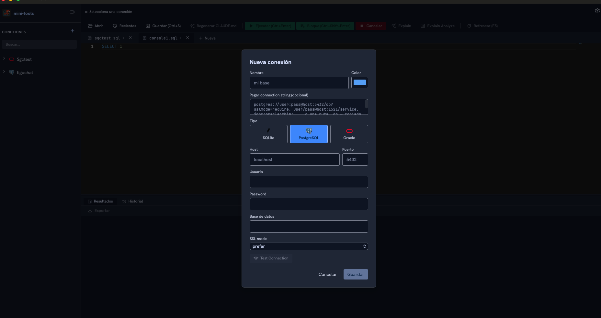
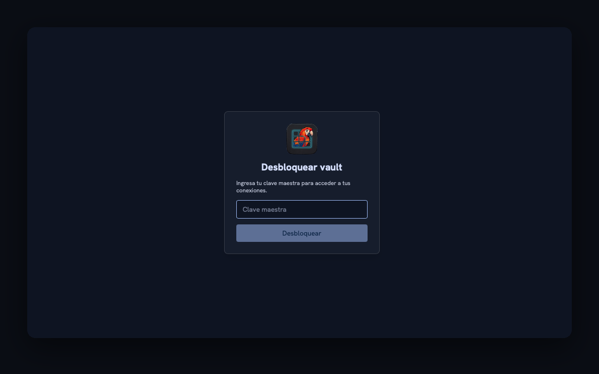
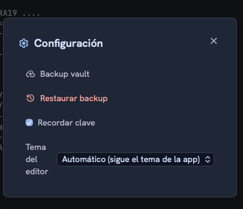

# mini-tools


Cliente de escritorio para **Oracle, PostgreSQL, SQLite, SQL Server, Redis y MongoDB**, más **terminal SSH** y **transferencia de archivos por SFTP** — tipo DataGrip + RedisInsight + Termius, pero minimalista y en un solo binario nativo. Go + Wails v2 en el backend, React + Tailwind en el frontend. Sin Electron, sin JVM, sin telemetría.

> El spec funcional completo vive en [docs/SPEC.md](docs/SPEC.md); la arquitectura y convenciones actuales del código en [CLAUDE.md](CLAUDE.md).

## Descargas

| Plataforma | Archivo | Notas |
|---|---|---|
| macOS (Apple Silicon) | **[⬇ mini-tools-v0.4.0.dmg](releases/macos/mini-tools-v0.4.0.dmg)** | Sin firmar — Gatekeeper avisa "desarrollador no identificado", ver [workaround](#distribución--empaquetado-macos) |
| Windows (x86-64) | **[⬇ mini-tools-v0.4.0-windows-amd64.exe](releases/windows/mini-tools-v0.4.0-windows-amd64.exe)** | Portable, sin instalador, sin firmar — SmartScreen avisa, ver [workaround](#distribución--empaquetado-windows). Verificado en Windows 10 y 11. |

Checksums, detalle de compatibilidad e instrucciones paso a paso en [releases/macos/README.md](releases/macos/README.md) y [releases/windows/README.md](releases/windows/README.md).

## Capturas

<p align="center">
  
</p>

<p align="center"><em>Editor CodeMirror con autocompletado consciente del contexto, tabs que se reordenan arrastrando, transacciones explícitas siempre visibles y un ícono de Configuración a un click de distancia.</em></p>

<p align="center">
  
</p>

<p align="center"><em>Redis Browser: pestaña de ventana completa por conexión Redis — filtro por tipo con badges de color, stats de keys/memoria, selección múltiple con exportación a JSON/CSV, y edición inline del valor (string, JSON, hash, list, set, zset) preservando el TTL.</em></p>

### 🖥️ Terminal SSH, temas y consola de ejecución

<table>
  <tr>
    <td align="center" width="62%">
      <br>
      <sub>Terminal SSH interactiva real (xterm.js) por conexión, en su propia pestaña — PTY con streaming en vivo, resize automático y cierre limpio de la sesión remota. Panel de <strong>Snippets</strong> para comandos/scripts guardados, reutilizables en cualquier sesión.</sub>
    </td>
    <td align="center" width="38%">
      <br>
      <sub>Selector visual de temas de terminal (Dracula, Nord, Solarized, Gruvbox, One Half…) con muestra de paleta, o Automático siguiendo el tema de la app.</sub>
    </td>
  </tr>
</table>

<table>
  <tr>
    <td align="center" width="42%">
      <br>
      <sub>Conexiones SSH en su propio módulo de sidebar: auth por password o private key (+ passphrase) y Agent Forwarding, con Test Connection antes de guardar.</sub>
    </td>
    <td align="center" width="58%">
      <br>
      <sub>Consola de ejecución estilo SQL Developer: cada statement con su texto completo y una línea de resultado con hora — <em>N filas obtenidas</em>, <em>completado</em>, o el <em>ERROR</em> completo sin recortar.</sub>
    </td>
  </tr>
</table>

### 📂 Transferencia de archivos por SFTP <sub>· nuevo en 0.2.4</sub>

> **Explorador de doble panel que reutiliza tus conexiones SSH** — arrastrá archivos entre paneles y transferí en cualquier dirección: **local → remoto, remoto → local y remoto → remoto** (streaming a través de tu máquina). Cola de transferencias con **porcentaje en vivo** y **cancelación**, procesamiento de lotes grandes en paralelo (pool de goroutines) **sin dejar procesos colgados** al cancelar o desconectar. Listado tipo Finder con columnas ordenables (Nombre, Fecha, Tamaño, Kind, Permisos), menú contextual (Enviar / Renombrar / Eliminar / Nueva carpeta) y diálogo de **permisos (chmod)** con toggles Lectura/Escritura/Ejecución para Propietario/Grupo/Otros.

<table>
  <tr>
    <td align="center" width="34%">
      <br>
      <sub>Conexiones organizadas en carpetas, ícono real por motor (Oracle/PostgreSQL/SQLite/Redis), y tablas/procedures/functions/triggers en categorías colapsables y ordenadas — probado en vivo con un schema de 342 tablas</sub>
    </td>
    <td align="center" width="66%">
      <br>
      <sub>Nueva conexión: pegá una connection string y se completa sola, elegí motor (incluido Redis: standalone/cluster/sentinel) con un click y ponele un color propio</sub>
    </td>
  </tr>
</table>

<table>
  <tr>
    <td align="center" width="52%">
      <br>
      <sub>Conexiones cifradas en un vault local — sin la clave maestra, no hay acceso.</sub>
    </td>
    <td align="center" width="48%">
      <br>
      <sub>Configuración centralizada: backup y <strong>restaurar</strong> el vault, recordar clave maestra y tema del editor — todo en un modal propio, no suelto en la barra.</sub>
    </td>
  </tr>
</table>

> Los diálogos de nueva conexión (SQL y SSH) y la pantalla de desbloqueo son ejemplos ficticios. El editor, el árbol de conexiones, el Redis Browser y la terminal SSH muestran datos reales con nombres de tabla/conexión difuminados y, en el Redis Browser, los nombres de key y el valor de la key seleccionada pixelados a propósito (esa captura en particular exponía una key con un secreto real) — el resto de la interfaz (toolbar, tabs, badges de tipo, ícono por motor, colores) es exactamente como se ve en uso normal.

## Por qué

La mayoría de clientes SQL multi-motor son pesados (JVM, Electron, cientos de MB). mini-tools apunta a lo contrario: un binario nativo liviano, dark por defecto, sin telemetría, con las conexiones cifradas en un vault local — nada más.

## Features

- **6 motores nativos**: Oracle (TNS / Easy Connect / SID / Service Name), PostgreSQL (SSL modes completos), SQLite y SQL Server (T-SQL, instancias con nombre, modos de encriptación) — vía `database/sql`, sin cliente Oracle/Postgres/SQL Server instalado aparte —, Redis (Standalone/Cluster/Sentinel, ACL, TLS) vía `go-redis`, con soporte de primera clase para RediSearch (`FT.SEARCH`/`FT.AGGREGATE`) y RedisJSON (`JSON.*`), y MongoDB (`mongodb://` y SRV/Atlas, replica sets) con lenguaje mongosh en el editor y explorador de documentos estilo Compass.
- **Vault cifrado local**: las conexiones se guardan en SQLite, con el DSN cifrado columna a columna (AES-256-GCM, clave derivada con Argon2id). Sin clave maestra correcta, no hay acceso — no hay bypass.
- **Backup/restore protegido por clave maestra**: exportar e importar el vault completo (conexiones + salt) como un solo archivo. Tanto generar el backup como restaurarlo piden tu clave maestra — se verifica contra el propio archivo antes de tocar nada, así que un backup que termine en otra máquina, USB o la nube no sirve de nada sin ella.
- **Pegar connection string**: copiá una URL de Postgres, un Easy Connect/SID/TNS de Oracle, un JDBC, o una ruta SQLite (directo de un `.env`) y el formulario de conexión se completa solo, detectando el motor.
- **Ícono real por motor y color de etiqueta por conexión**: cada conexión muestra el logo de Oracle/PostgreSQL/SQLite/Redis y un color a elección (elegible al crear o editar) — distinguís de un vistazo cuál es cuál sin leer el nombre, sobre todo útil con muchas conexiones abiertas.
- **Carpetas para organizar conexiones**: crear, renombrar, mover y reordenar carpetas desde el propio árbol — "Conexiones" es un módulo de acordeón colapsable en el sidebar.
- **Conexiones SSH** en su propio módulo de sidebar — "SSH", separado de "Conexiones" — con el mismo patrón de carpetas (crear/renombrar/mover/reordenar) pero un árbol completamente propio, nunca mezclado con las carpetas de base de datos. Auth por password o private key (+ passphrase opcional) más Agent Forwarding, y Test Connection antes de guardar como cualquier otro motor.
- **Terminal interactiva real (xterm.js)** por conexión SSH: se abre en su propia pestaña — reabrir la misma conexión enfoca esa pestaña en vez de duplicarla — con streaming de la sesión remota vía PTY y resize automático. Cerrar la pestaña corta la sesión del lado remoto, no la deja colgada.
- **Temas de terminal**: selector visual con muestra de paleta (Dracula, Nord, Solarized Dark/Light, Gruvbox, One Half, Tomorrow Night, GitHub Light…) o Automático siguiendo el tema de la app — un ajuste global que aplica a todas las sesiones SSH abiertas.
- **Snippets SSH**: comandos o scripts guardados, reutilizables en cualquier sesión SSH abierta (no atados a una conexión), con carpetas propias y buscador por nombre/contenido — botones Ejecutar (corre cada línea) y Pegar (los escribe sin confirmar).
- **Transferencia de archivos por SFTP** reutilizando tus conexiones SSH: explorador de doble panel (estilo Termius) que se abre desde el árbol SSH. Transferí en cualquier dirección — **local → remoto, remoto → local y remoto → remoto** (streaming a través de tu máquina) — arrastrando entre paneles o con el botón Enviar. Cola de transferencias con **porcentaje/bytes/archivos en vivo** y **cancelación** por transferencia; los lotes grandes se procesan en paralelo (pool de goroutines) y **no dejan procesos colgados** al cancelar o perder la conexión. Listado tipo Finder con columnas ordenables (Nombre, Fecha, Tamaño, Kind, Permisos), menú contextual (Enviar/Renombrar/Eliminar/Nueva carpeta/Refrescar) y diálogo de **permisos (chmod)** con toggles Lectura/Escritura/Ejecución para Propietario/Grupo/Otros.
- **Guardar sin depender de un ping**: crear o editar una conexión nunca exige que el Test Connection haya sido exitoso — guardás igual si el servidor está apagado ahora pero lo vas a usar más tarde. Test Connection sigue ahí como verificación opcional.
- **Selector de esquemas al crear la conexión**: en Postgres, después de un Test Connection exitoso elegís qué esquemas escanear — clave en catálogos con cientos de esquemas donde un escaneo completo es lento. Editable después desde el árbol de conexiones.
- **Editor** (CodeMirror 6, sin CDN) con syntax highlighting real para SQL y para comandos Redis, tabs reordenables por drag-and-drop, archivos recientes, y pestañas restauradas automáticamente al reabrir la app — incluidas las pestañas del Redis Browser.
- **Redis Browser**: pestaña de ventana completa por conexión Redis — filtro por tipo con badges de color, buscador por patrón, stats de header (total de keys / memoria), selección múltiple con exportación a JSON/CSV, y edición inline del valor (string, JSON, hash, list, set, zset — streams de solo lectura) que siempre preserva el TTL existente.
- **Scanner de objetos de esquema**: procedures, functions y triggers (PostgreSQL, Oracle) y packages (Oracle) además de tablas, agrupados en categorías colapsables por schema. Un click muestra el DDL actual en un visor con syntax highlighting (CodeMirror), botón de copiar y de exportar a `.sql`.
- **Autocompletado consciente del contexto**: sugiere tablas después de `FROM`/`INSERT INTO`/`UPDATE` y columnas acotadas a las tablas realmente referenciadas después de `SELECT`/`WHERE`/`SET`; resuelve alias y esquema al tipear un punto (`u.` → columnas de `users` si `u` es su alias).
- **Transacciones explícitas**: auto-commit es un checkbox, Commit/Rollback siempre visibles (deshabilitados cuando no aplican) — nunca hay ambigüedad sobre si un cambio quedó confirmado.
- **Ejecución con streaming**: resultados en vivo statement por statement, cancelación en caliente, soporte de scripts multi-statement y bloques PL/SQL de Oracle (con `DBMS_OUTPUT` capturado). Múltiples resultados (uno por statement) en pestañas que se cierran individualmente o todas juntas.
- **Consola de ejecución** (estilo DataGrip/SQL Developer): pestaña propia junto a Resultados/Historial que registra cada statement de un script con su texto completo y una línea de resultado con hora (`N filas obtenidas en Xms`, `completado en Xms`, o el `ERROR` completo sin recortar) — se activa sola en cualquier script de más de un statement.
- **Historial de ejecuciones** por conexión: SQL exacto, estado, duración y error completo de cada statement corrido — filtrable, borrable entero o fila por fila.
- **Grid de resultados** virtualizado para miles de filas sin lag, columnas redimensionables/ordenables (el sort reemite la query con `ORDER BY`, no ordena en cliente). Seleccionar una fila habilita copiarla como texto, `INSERT` o `UPDATE` listos para pegar en el editor.
- **Árbol de conexiones** colapsable a una barra de solo íconos, con buscador que cubre tablas y también procedures/functions/triggers/packages, categoría de tablas colapsable y siempre ordenada alfabéticamente (probado con un schema real de 342 tablas), export de DDL (objeto puntual o esquema completo) desde el propio árbol, y layout (sidebar colapsado, alto del editor) recordado entre sesiones.
- **Configuración centralizada**: backup del vault y "recordar clave maestra" viven en un modal de Configuración propio, abierto desde el ícono de engranaje — no sueltos en la barra de herramientas.
- **EXPLAIN PLAN visual**: árbol de plan de ejecución para los 3 motores, con detección de full table scan resaltada.
- **Linter SQL básico**: marca `SELECT *` como sugerencia visual (no bloquea) y `UPDATE`/`DELETE` sin `WHERE` con confirmación antes de ejecutar.
- **Export**: CSV, JSON, XLSX, DDL de tabla/schema completo, y config de conexión (sin password) — más "copiar como INSERT" desde el grid.
- **Tooltips contextuales** en cada control, pensados para alguien que abre la app por primera vez. Toda confirmación (borrar historial, backup del vault) usa un modal propio con el tema de la app, nunca un diálogo nativo del navegador.
- Interfaz Material Design 3, dark/light con toggle persistido, tipografías e íconos empaquetados con la app (sin depender de internet para renderizar).

## Requisitos

- [Go](https://go.dev/dl/) 1.26 o superior
- [pnpm](https://pnpm.io/) — nunca `npm` ni `yarn`
- Node.js (solo para compilar el frontend; no hay runtime Node en producción)
- [Wails CLI v2](https://wails.io/) (el script de instalación de abajo lo instala si falta)

## Instalación

```bash
git clone https://github.com/rafael180496/mini-tools.git
cd mini-tools
./scripts/install.sh
```

## Comandos

```bash
./scripts/install.sh      # toolchain (Wails CLI si falta) + deps de Go y frontend
./scripts/start-dev.sh    # wails dev — backend Go + frontend Vite con hot reload
./scripts/build.sh        # wails build -clean — build de producción, binario objetivo <80MB
./scripts/start.sh        # corre el binario ya compilado en build/bin/, sin recompilar
./scripts/clean.sh        # borra build/bin + frontend/dist (--all también node_modules y cache de Go)
```

Equivalentes directos, por si hace falta correrlos sin los wrappers:

```bash
wails dev
wails build -clean

cd frontend && pnpm install   # pnpm siempre, nunca npm/yarn
cd frontend && pnpm build

go build ./...
go vet ./...
go test ./...
```

Detalle de cada script en [scripts/README.md](scripts/README.md).

## Empaquetar una versión nueva

```bash
./scripts/bump-version.sh patch   # opcional — bumpea VERSION antes de empaquetar
./scripts/package-all.sh          # empaqueta macOS + Windows juntos (default)
```

`package-all.sh` corre `package-macos.sh` (salteado automáticamente si no
se ejecuta desde macOS) y `package-windows.sh` en una sola pasada. Para
empaquetar un solo SO puntual, correr su script directo — ver el detalle
de cada plataforma abajo.

## Distribución / Empaquetado macOS

```bash
./scripts/bump-version.sh patch   # opcional — bumpea VERSION antes de empaquetar
./scripts/package-macos.sh        # genera build/bin/mini-tools-vX.Y.Z.dmg
```

El `.dmg` resultante **no está firmado** (sin Apple Developer ID ni notarización) — al abrirlo en otra Mac, Gatekeeper va a mostrar "desarrollador no identificado". Workaround: clic derecho sobre la app → Abrir, o `xattr -cr /Applications/mini-tools.app`, o Ajustes del Sistema → Privacidad y Seguridad → Abrir de todas formas.

`package-macos.sh` solo genera el `.dmg` localmente — no crea releases ni sube nada a ningún lado, eso es manual.

### Última versión empaquetada

| Campo | Valor |
|---|---|
| Versión | 0.4.0 |
| Plataforma | macOS — **Apple Silicon (`arm64`) únicamente**, no corre en Mac Intel ni vía Rosetta |
| Compatible desde | macOS 11 (Big Sur) en la práctica — es la primera versión de macOS con hardware Apple Silicon; el `Info.plist` de Wails declara `10.13.0` por plantilla genérica (heredada de cuando también soportaba Intel), no es una garantía real |
| Archivo | **[⬇ Descargar mini-tools-v0.4.0.dmg](releases/macos/mini-tools-v0.4.0.dmg)** |
| SHA-256 | `d954599db7735c20a9fa86462c416725c836d6554d283f5c33eb03677e661355` |
| Firma | Sin firmar (ver workaround de Gatekeeper arriba) |

## Distribución / Empaquetado Windows

```bash
./scripts/bump-version.sh patch   # opcional — bumpea VERSION antes de empaquetar
./scripts/package-windows.sh      # genera build/bin/mini-tools-vX.Y.Z-windows-amd64.exe
```

Cross-compilado desde macOS/Linux con `wails build -platform windows/amd64` — ninguno de los conectores de base de datos usa CGO, así que no hace falta un toolchain de Windows. **Portable, sin instalador** (no arma NSIS) y **sin firma Authenticode** — SmartScreen va a avisar "Windows protegió su PC" al abrirlo; workaround: "Más información" → "Ejecutar de todas formas".

> ✅ **Verificado en Windows 10 y Windows 11 reales** (desde 0.4.0) — la app arranca y funciona en ambos, sin instalar el WebView2 Runtime aparte, con DPI scaling y diálogos nativos correctos. Detalle completo en [releases/windows/README.md](releases/windows/README.md).

`package-windows.sh` solo genera el `.exe` localmente — no crea releases ni sube nada a ningún lado, eso es manual.

### Última versión empaquetada

| Campo | Valor |
|---|---|
| Versión | 0.4.0 |
| Plataforma | Windows — **`amd64` (x86-64) únicamente**, cross-compilado desde macOS y verificado corriendo en Windows 10 y 11 |
| Archivo | **[⬇ Descargar mini-tools-v0.4.0-windows-amd64.exe](releases/windows/mini-tools-v0.4.0-windows-amd64.exe)** |
| SHA-256 | `3c9017fee6a1e161eabc4e78bcc3fd6650ca342b864acc6e16603770ed581b38` |
| Firma | Sin firmar (SmartScreen va a avisar, ver workaround arriba) |

Detalle completo, checksum de verificación e instrucciones de instalación paso a paso en [releases/macos/README.md](releases/macos/README.md).

## Estructura del proyecto

```text
/backend        crypto (Argon2id + AES-256-GCM), vault (SQLite cifrado columna a columna),
                 conectores de los 6 motores de base de datos (Oracle/PostgreSQL/SQLite/SQL Server/Redis/MongoDB),
                 ejecución de queries (streaming/cancelación), sshconn (sesiones SSH interactivas vía PTY),
                 EXPLAIN PLAN, export, generador de CLAUDE.md
/frontend       React + TypeScript + Vite + Tailwind v4, editor CodeMirror 6, terminal xterm.js
app.go          superficie completa de binding Go ↔ React
main.go         bootstrap de Wails, embed de frontend/dist
```

Detalle completo (stack, estructura fase a fase, contrato de bindings) en [CLAUDE.md](CLAUDE.md) → [.claude/specs/architecture.md](.claude/specs/architecture.md).

## Seguridad

- El DSN de cada conexión se cifra con AES-256-GCM antes de guardarse; la clave se deriva de tu clave maestra con Argon2id y nunca se persiste en ningún lado. Para SSH esto incluye el password, la private key completa y su passphrase — mismo tratamiento que el DSN de cualquier otro motor, nunca un campo aparte sin cifrar.
- Sin clave maestra correcta, la app no arranca — no hay bypass, ni siquiera desde las bindings internas.
- El DSN (y las credenciales SSH) nunca llegan al frontend ni se loguean, tampoco en modo debug — "Exportar configuración" redacta password/private key/passphrase antes de escribir el archivo.
- Los backups del vault están atados a la clave maestra: generarlos y restaurarlos piden la clave, verificada contra el propio archivo de backup — no contra la instalación local, porque un backup puede restaurarse en otra máquina.

## Licencia

[MIT](LICENSE)
