# mini-tools


### Tu cliente de base de datos, tu terminal, tu cliente Git y tus agentes de IA — en un solo binario de 50 MB.

Sin Electron. Sin JVM. Sin cuenta. Sin telemetría. Tus credenciales cifradas en tu máquina y nada saliendo a ningún lado.

**Oracle · PostgreSQL · SQLite · SQL Server · Redis · MongoDB · SSH · SFTP · Git · Claude Code · Codex · Antigravity**

<p align="center">
  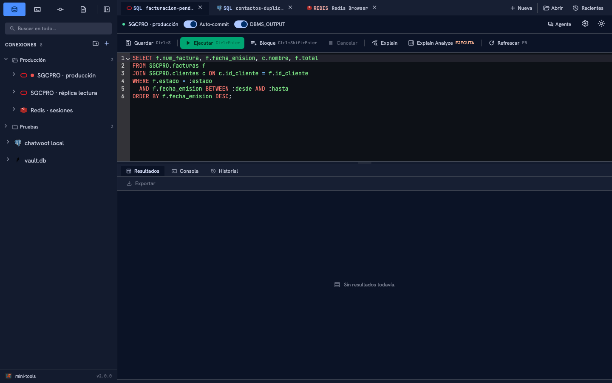
</p>

---

## Novedades — 2.2.0

**La versión en la que el agente deja de ser solo un lector.** La 2.0.0 trajo la
IA a todos los módulos y la 2.1.0 se ocupó de la app en sí; esta le da al
asistente permiso para escribir en tu base de conocimiento, suma las terminales
del sistema operativo al módulo SSH, y pone a la vista cuánta cuota te queda en
cada proveedor.

- **El servidor MCP ahora escribe: el agente puede crear notas y corregir las
  suyas.** Con el permiso activado —apagado por defecto, con su propio
  interruptor— cualquier CLI conectado puede dejar asentado lo que averiguó como
  una nota nueva en tu «cerebro», y volver sobre ella para ampliarla. **Nunca
  toca lo que escribiste vos**: solo reescribe notas que creó él y que nadie
  editó después, apenas guardás una de las suyas pasa a ser tuya, una nota
  privada le queda fuera de alcance igual que para leer, y borrar no puede nunca.
  Cada nota que crea queda marcada como suya en su frontmatter, y cada alta y
  cada cambio quedan en el registro de accesos.
- **Terminales de tu máquina dentro del módulo SSH.** PowerShell, zsh, bash o el
  intérprete que tengas configurado, cada uno en su pestaña, con **los mismos
  snippets** que ya usabas contra los servidores y **su propio historial** por
  intérprete —cifrado, con el mismo filtro que descarta las líneas que parecen
  traer una contraseña—. El trabajo real cruza las dos orillas todo el tiempo: se
  mira un log en el server, se copia algo a la máquina de uno, se corre un `scp`.
- **Cuánta cuota llevás usada, por proveedor y sin salir de la app.** Barras con
  el porcentaje de la ventana de 5 horas y de la semanal, la hora en que se
  midieron y cuándo se reinician. No es una división inventada: se lee el número
  que ya calculó el servidor de cada proveedor y que su CLI dejó cacheado en
  disco. Antigravity, que no lo guarda en ningún archivo, se consulta
  preguntándole a su propio CLI con un botón.
- **Las notas entienden tablas** —y listas numeradas, de verificación, anidadas,
  tachado, imágenes y bloques plegables—. Las tablas se dibujan como tablas
  **mientras escribís** y vuelven a texto plano cuando el cursor entra en ellas,
  igual que ya pasaba con los títulos y los enlaces. Y cada renglón que escribís
  es un renglón al leer la nota, como en Obsidian.
- **Git: el commit se escribe solo si querés.** Un botón ✦ dentro del campo del
  mensaje se lo pide al agente por defecto, a partir del diff **preparado** y del
  estilo de los últimos commits del repositorio. Y hacer clic en un commit ahora
  muestra qué hizo: mensaje, refs, churn y **cada archivo desplegable con su
  diff adentro**, sin ir y volver al panel de la derecha.
- **El chat deja de hacerte esperar.** Escribí mientras el agente trabaja: el
  mensaje queda en cola y sale al terminar el turno (y si el turno falla o lo
  cortás, la cola se frena en vez de vaciarse). Además se puede **buscar dentro
  de la conversación** y **reusar** un mensaje propio para mandarlo corregido.

---

## Trabajar con agentes, de verdad

<p align="center">
  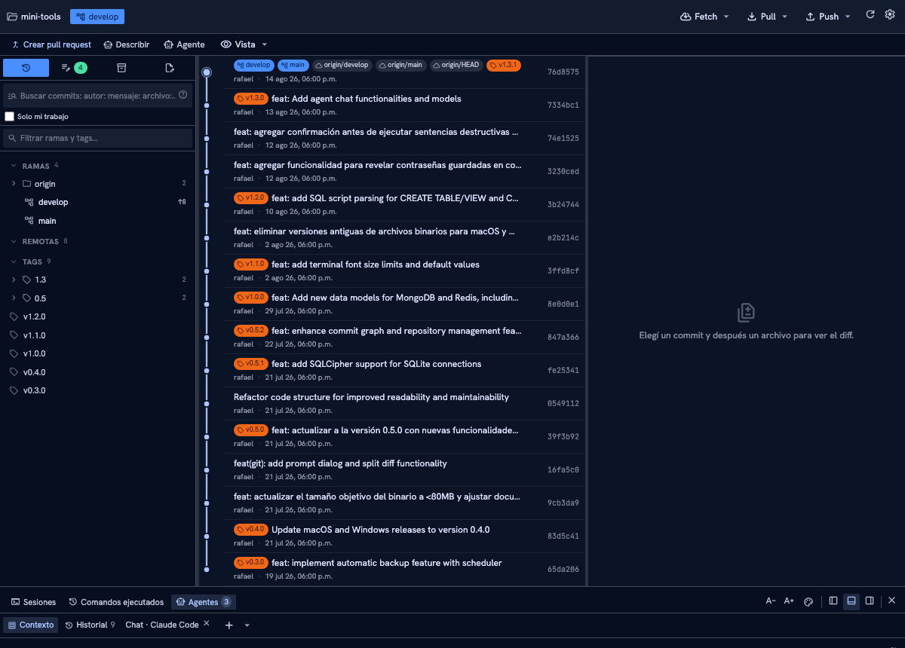
</p>

Abrí un repositorio y el panel **Agentes** te dice lo que ningún otro cliente te dice:

- **Qué tiene preparado este repo** para un agente: sus skills, sus subagentes, sus comandos — y **cuáles archivos de instrucciones le faltan**. Cada CLI lee el suyo y no el de los otros: un repo impecablemente documentado en `CLAUDE.md` no le dice *nada* a Codex. Eso es invisible hasta que alguien lo dibuja.
- **Qué herramientas MCP ve cada agente**, de dónde salen, y cuáles son remotas — las que mandan contexto de tu repo fuera de la máquina. Podés agregar y quitar servidores desde acá.
- **Cuántos tokens llevás gastados**, con qué modelo, cuánto se fue en *este* repositorio, y **con qué plan** estás.

### Modo agente: un botón que despeja la pantalla

<p align="center">
  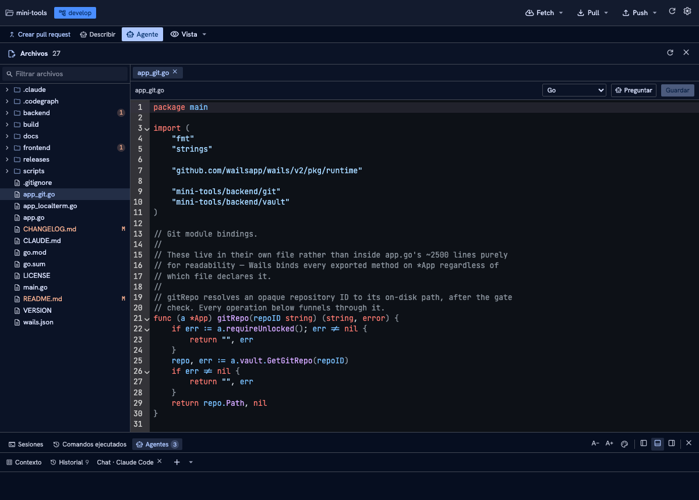
</p>

Cuando trabajás con un agente no te importan las ramas, el grafo ni el diff — te importa **qué archivos hay** y **qué está haciendo**. El botón **Agente** esconde el resto del módulo Git y deja eso: el árbol del proyecto, con la letra de git en cada archivo modificado y el conteo de cambios en cada carpeta, más la conversación. El mismo botón te devuelve todo tal como lo tenías.

### El historial de todas tus conversaciones, también las de afuera

<p align="center">
  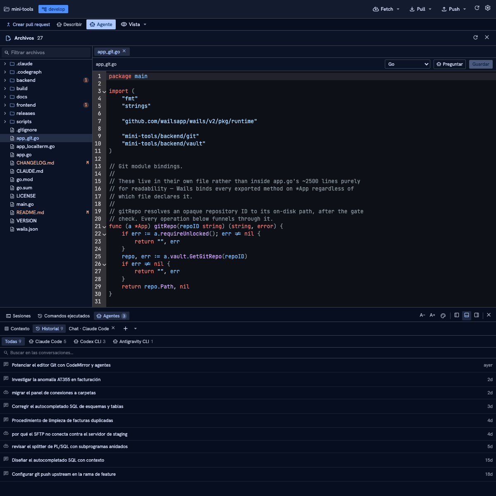
</p>

Cada repositorio tiene su historial, con **pestañas por proveedor**, buscador, y renombrar o quitar en cada fila. Y no solo lo que abriste desde acá: también lista **las conversaciones que el CLI ya tenía** de ese repositorio — las mismas que ves en la extensión de VS Code o en la terminal. Abrir una la retoma donde la dejaste; los mensajes los sigue teniendo el CLI, esta app no guarda una segunda copia.

### Chat con permisos que se entienden

<p align="center">
  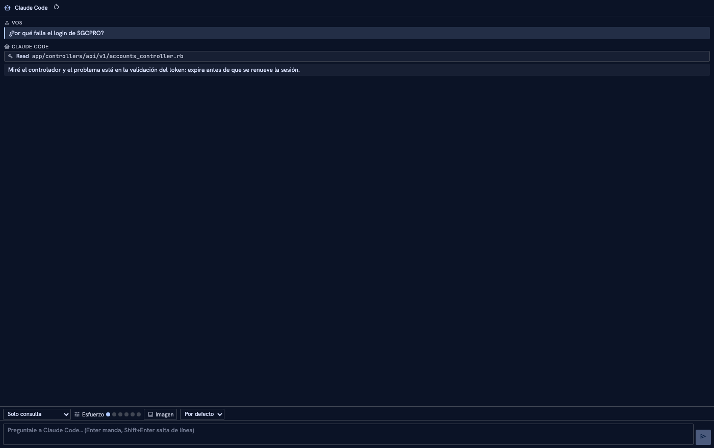
</p>

El chat muestra **qué está haciendo** el agente: cada llamada a herramienta con su archivo y su tamaño, plegable, y los tokens de cada turno. Arriba de la caja de texto elegís qué le permitís:

| Modo | Qué puede hacer |
|---|---|
| **Solo consulta** | Lee, razona y propone. No toca nada. |
| **Plan** | Explora y arma un plan, explícitamente sin editar. |
| **Aprobar cada acción** | Trabaja, pero **te pregunta antes de cada acción** y espera tu respuesta. |
| **Automático** | Aprueba lo que pasa su propio control de seguridad y frena en lo riesgoso. |
| **Aplicar ediciones** | Modifica archivos sin preguntar. |

Los tres últimos **se aprueban una vez, explícitamente**, con un diálogo que dice qué vas a permitir. Y hay una línea que no se cruza: **nunca se le pasa al CLI la bandera que saltea todos los permisos**, ni en el modo más suelto — esa cubre también ejecutar comandos arbitrarios, y no es lo mismo que editar archivos versionados.

Cuando el agente termina de trabajar solo, te dice **cuántos archivos tocó** y te lleva a revisarlos. Caen en el árbol de trabajo de git: los ves en Cambios y los descartás con un clic.

### El mismo chat, sobre tu base de datos

<p align="center">
  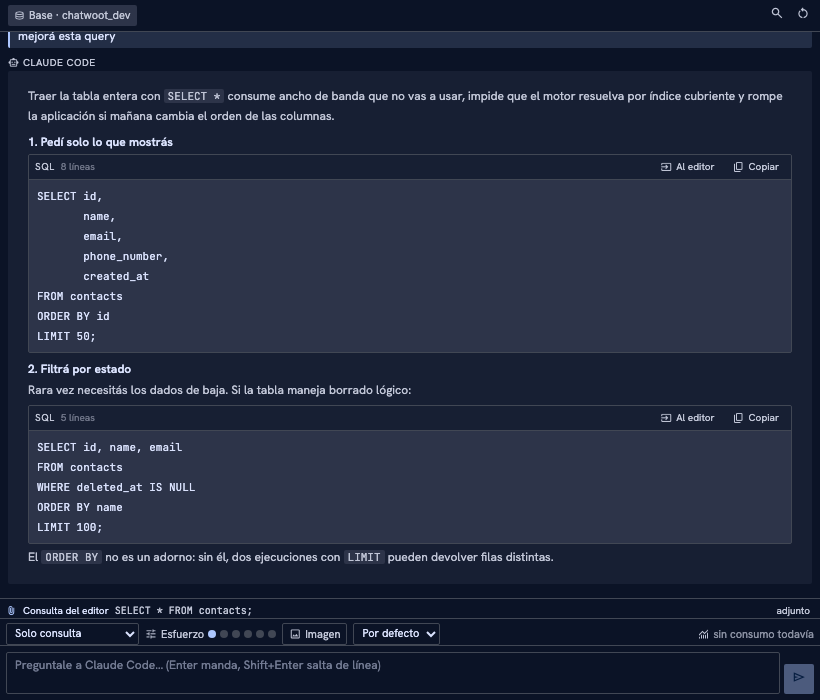
</p>

Es el **mismo componente** que el chat de código, abierto sobre una conexión: la
consulta que estás escribiendo va adjunta —se puede abrir para ver exactamente
qué se manda, y sacarla con un clic—, así que *"mejorá esta query"* por fin
tiene una query. Y cada bloque de la respuesta trae **Copiar** y **Al editor**:
el SQL corregido entra en la posición del cursor sin pisar lo que tenías.

Cada módulo mantiene su propia conversación: la de una conexión no arrastra lo
que hablaste sobre un servidor SSH ni sobre una nota.

### Cuánto llevás gastado, sin inventar el número

<p align="center">
  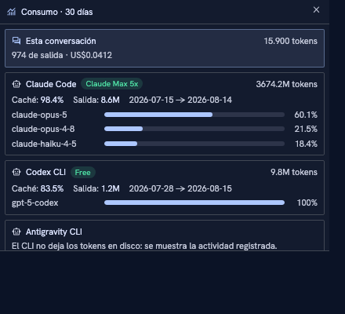
</p>

Lo de **esta** conversación arriba, y debajo cada CLI de los últimos 30 días con
su plan al lado — sin él, un total de tokens es un número sin escala—, el
reparto por modelo y qué parte de la entrada resolvió el caché, que es el único
de esos números sobre el que se puede actuar.

Lo que **no** vas a ver es un "82% de tu plan usado": ese dato lo tiene el
servidor de tu proveedor, no un archivo local. Un porcentaje sacado de una
división inventada es la clase de número que se lee mal y se cree igual.

### Servidor MCP: que el agente pida, en vez de mandarle

<p align="center">
  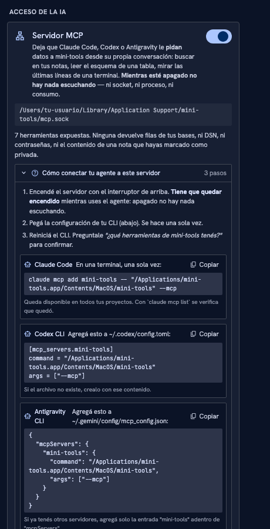
</p>

Encendido, Claude Code, Codex o Antigravity pueden **pedirle** datos a
mini-tools desde su propia conversación: buscar en tus notas, leer el esquema de
una tabla, mirar las últimas líneas de una terminal. Con el instructivo adentro
de la app y la configuración lista para copiar, con la ruta real de tu
ejecutable ya puesta.

**Apagado no hay absolutamente nada corriendo** — ni socket, ni proceso, ni
consumo. Nunca se abre un puerto de red: el canal es un socket local con
permisos de tu usuario. Y sin la ventana abierta y el vault desbloqueado no hay
datos, porque el proceso que lanza el CLI **no tiene la clave maestra**. Debajo
del interruptor queda el registro de qué se pidió y cuándo: confiar en la regla
y poder verificarla son dos cosas distintas.

### Y lo que se espera de un chat

Pegá una captura con `⌘V` en cualquier parte del panel, escribí `@` para referenciar un archivo del repo, retomá una conversación de la semana pasada con **el mismo modelo y esfuerzo** con los que la venías trabajando, o abrí **dos agentes en paralelo** — uno escribiendo, otro revisando lo que el primero hizo.

---

## Notas — tu documentación, viva y cifrada

<p align="center">
  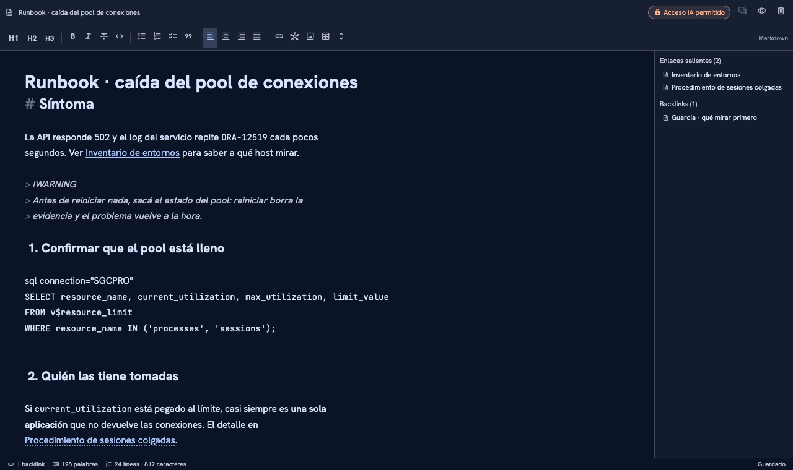
</p>

Los runbooks, los procedimientos y las notas de incidentes viven **adentro del
vault**, cifrados con la misma clave maestra que tus conexiones. Y se escriben
como en Notion: el Markdown **se ve formateado mientras lo escribís** —las
marcas aparecen solo en la línea donde está el cursor, que es cuando hacen
falta—, con barra de formato para quien no lo escribe de memoria, alineación de
documento, autocompletado de `[[enlaces]]` y de `#etiquetas`, y un revisor que
avisa lo que ninguna otra herramienta te va a marcar: un enlace a una nota que
todavía no existe (con "crearla" a un clic), un bloque de código sin cerrar, o
el `#Titulo` sin espacio que vos creías que era un título y en realidad es una
etiqueta.

**Pegá una captura con `⌘V`** y queda incrustada en el documento, cifrada igual
que el texto: una captura de un tablero de producción es tan sensible como el
párrafo que la acompaña — y más delatora, porque se entiende de un vistazo. Solo
PNG y JPG, y los PNG se recomprimen **sin perder un solo píxel**.

<p align="center">
  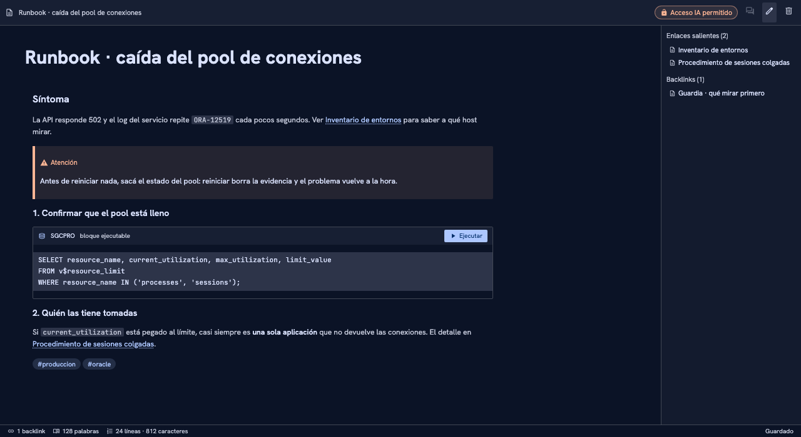
</p>

**Los runbooks se ejecutan.** Un bloque ```` ```sql connection="SGCPRO" ````
trae su botón **Ejecutar**, contra tu conexión de verdad y con el mismo
Production Guard del editor. El resultado no se guarda en la nota: es una
consulta, no documentación.

<p align="center">
  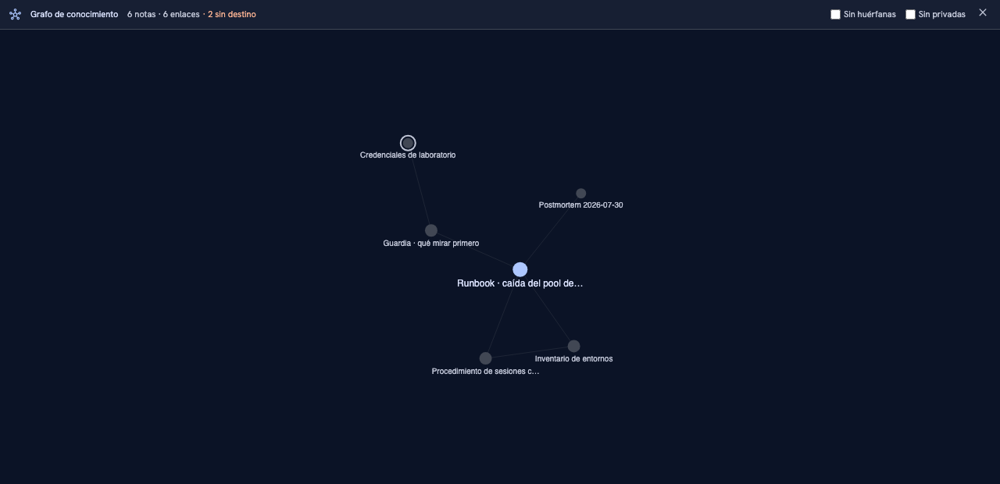
</p>

Todo lo que enlazás arma un **grafo** — y también el árbol del panel lateral,
donde cada nota cuelga de la que la enlaza. Los **backlinks** son la mitad más
útil: los enlaces que salen ya los ves al escribir, los que entran son los que
uno no recuerda haber puesto.

**El candado es contra los agentes, no contra vos.** Marcar una nota como
privada la esconde de forma absoluta —ni el chat ni el servidor MCP pueden
leerla, y el filtro está en la consulta, no en un `if`—, sin dejar de verla vos
ni de aparecer en tu grafo y tus búsquedas. Las notas nacen **visibles**, porque
para eso está el grafo; esconder una es una decisión con su propia confirmación.

Y un buscador que sirve para buscar: encuentra `Diagnóstico` escribiendo
`diagnostico`, exige todas las palabras en cualquier orden, entiende frases
entre comillas y filtros (`tag:`, `enlaza:`, `privado:`), y te muestra el
fragmento donde acertó.

---

## Git, completo

<p align="center">
  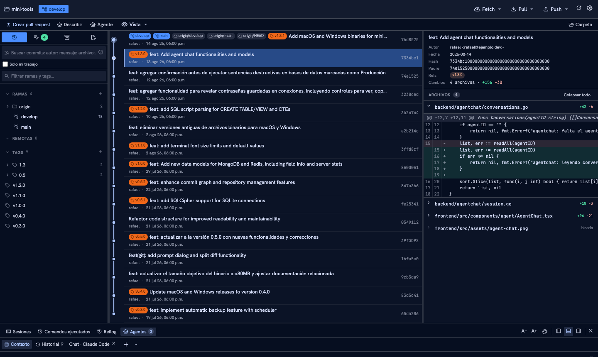
</p>

Cliente Git estilo Sublime Merge sobre el `git` de tu sistema — así que tus credential helpers, tu `ssh-agent` y tus hooks siguen funcionando igual. Grafo de commits, diff unificado o lado a lado, stage por bloque, rebase interactivo, stashes, worktrees, resolutor de conflictos de tres vías, y un **log de los comandos exactos** que la app ejecutó por debajo, con su salida.

Además: **editor de archivos** con resaltado para más de treinta lenguajes, árbol plegable con los indicadores de cambio de git, vista previa de Markdown en tres modos, y **botones para abrir el proyecto en VS Code o en el explorador de archivos** de tu sistema — que aparecen solo si están instalados de verdad.

---

## Bases de datos, SSH y SFTP

<p align="center">
  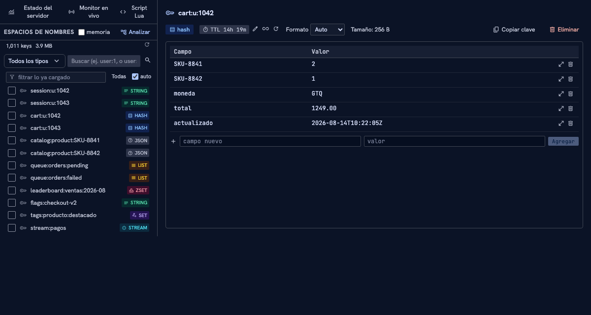
</p>

Seis motores nativos sin instalar un cliente aparte, editor con autocompletado que **entiende el contexto** (sugiere columnas de las tablas que realmente referenciaste, resolviendo alias), ejecución con streaming y cancelación, `EXPLAIN PLAN` visual, y export a CSV/JSON/XLSX/DDL.

Terminal SSH real con `xterm.js`, transferencia SFTP de doble panel con cola y cancelación, y snippets reutilizables.

Y cuando algo falla, **"Analizar error"**: le manda al agente lo que tengas seleccionado junto con el **sistema operativo del servidor** —el mismo error se arregla distinto en SunOS, RHEL, Ubuntu o Alpine— y devuelve los comandos exactos. Ninguno se ejecuta solo: se copian o se insertan en la línea, sin el Enter. Los secretos que hayan quedado impresos en la pantalla (`mysql -p…`, un token en una cabecera) **se ocultan antes de salir**, diciéndote cuántos. El explorador además puede **seguir a la terminal**: cuando hacés `cd`, el panel salta a esa carpeta.

---

## La grilla que escribe el UPDATE

<p align="center">
  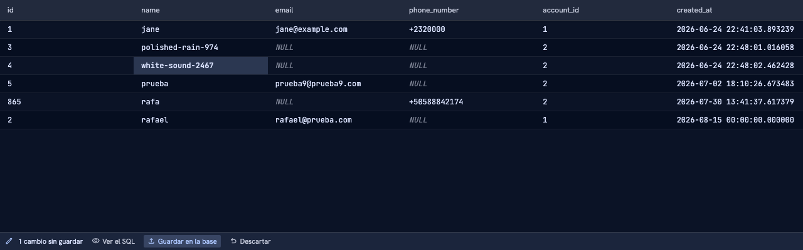
</p>

Doble clic en una celda, corregís el dato, y la app arma el `UPDATE` con su
`WHERE` por clave primaria. El cambio **queda pendiente y marcado** hasta que lo
mandás con `⌘↵` / `Ctrl+↵` — esa demora es a propósito: te deja ver el SQL
exacto antes, cambiar de opinión, y mandar varios cambios juntos.

**La regla que gobierna toda la función es no escribir nunca una fila que no se
pueda identificar sin ninguna duda**, porque un `WHERE` de más no se deshace con
Ctrl+Z. Por eso solo se ofrece editar cuando la consulta sale de **una** tabla
—sin JOIN, sin GROUP BY, sin subconsultas—, cuando esa tabla tiene **clave
primaria** y cuando la clave está en el resultado. Cuando no se puede, la grilla
**te dice por qué** en vez de esconder el botón.

Cada `UPDATE` corre en una transacción y tiene que afectar **exactamente una
fila**: si afecta otra cantidad se revierte el lote entero y te lo explica. Los
valores viajan como parámetros, nunca concatenados. Y el editor de cada celda
depende del tipo: selector de fecha y hora para un timestamp, desplegable para
un booleano, campo numérico para un número — con `NULL` como botón aparte,
porque «sin dato» y «texto vacío» no son lo mismo y la base guarda esa
diferencia.

---

## Descargas

| Plataforma | Archivo | Notas |
|---|---|---|
| macOS (Apple Silicon) | **[⬇ mini-tools-v2.2.0.dmg](https://github.com/rafael180496/mini-tools/releases/download/v2.2.0/mini-tools-v2.2.0.dmg)** | Sin firmar — Gatekeeper avisa "desarrollador no identificado", ver [workaround](#distribución--empaquetado-macos) |
| Windows (x86-64) | **[⬇ mini-tools-v2.2.0-windows-amd64.exe](https://github.com/rafael180496/mini-tools/releases/download/v2.2.0/mini-tools-v2.2.0-windows-amd64.exe)** | Portable, sin instalador, sin firmar — SmartScreen avisa, ver [workaround](#distribución--empaquetado-windows). **Esta versión no se probó en una Windows real**: lo nuevo de ese lado son las terminales locales (detección de PowerShell/cmd y ConPTY), ver [detalle](releases/windows/README.md). |

Los binarios se publican como assets del [GitHub Release](https://github.com/rafael180496/mini-tools/releases) de cada versión, no dentro del repositorio. Checksums, detalle de compatibilidad e instrucciones paso a paso en [releases/macos/README.md](releases/macos/README.md) y [releases/windows/README.md](releases/windows/README.md).

## Todo lo que trae

<details>
<summary><strong>Ver la lista completa de funcionalidades</strong></summary>

### Agentes de código

- **Tres CLIs integrados**: Claude Code, Codex CLI y Antigravity CLI, detectados solos en el PATH y en las rutas donde se instalan de verdad (`~/.local/bin`, npm, bun).
- **Dos formas de usarlos**: su terminal completa —con su propio render y su diálogo de permisos— o el **chat nativo**, que muestra cada acción y los tokens de cada turno.
- **Cinco modos de permiso**, del solo-consulta al aplicar-ediciones, cada uno aprobado explícitamente. La bandera que saltea *todos* los permisos no se pasa nunca.
- **Aprobación acción por acción** con un diálogo que dice qué está por hacer. Si algo falla en esa cadena, la respuesta es denegar: si no se pudo preguntar, no se pudo haber aprobado.
- **Consumo de tokens y plan** por agente, con el desglose por modelo y cuánto se fue en este repositorio.
- **Servidores MCP** de los tres CLIs, leídos de donde cada uno los guarda; se pueden agregar y quitar los que son archivos de configuración.
- **Skills, subagentes, comandos e instrucciones** que el repositorio le ofrece a un agente — incluidos los archivos que le faltan.
- **Historial de chats** por repositorio, agrupado por agente, con nombres editables y retomable después de cerrar la app.
- **Acciones agénticas en Git**: redactar el mensaje de commit desde el diff preparado, revisar antes de pushear, explicar un commit, describir un PR, asistir un conflicto, explicar un comando fallido.
- **Adjuntar imágenes** pegándolas o arrastrándolas.
- **Un solo chat para toda la app** (`⌘L` / `Ctrl+L`): la misma conversación desde el editor SQL, una terminal SSH o una nota. Cambiar de pestaña actualiza el contexto, no reinicia el hilo.
- **Sistema `@` de referencias**: `@db:Conexión/tabla` (DDL, cero filas), `@explain:last`, `@git:staged`, `@file:ruta`, `@note:"Título"`, `@ssh:Servidor`. Cada una se muestra como ficha desplegable con el texto exacto que se va a enviar.
- **Servidor MCP nativo**, apagado por defecto: encendido, los agentes pueden pedir datos ellos mismos; apagado no hay socket ni proceso. Sin la ventana abierta y el vault desbloqueado, no hay datos.
- **Registro de accesos** de la IA: qué pidió y cuándo, sin el contenido.
- **Instructivo del servidor MCP** adentro de la app: tres pasos y la configuración lista para copiar de cada CLI, con la ruta real de tu ejecutable ya puesta.
- **Copiar cualquier mensaje o bloque de código** del chat, y **"Al editor"** para insertar ese bloque donde está el cursor —el editor SQL o la nota abierta— sin pisar lo que tenías.
- **Consumo y plan desde el chat**, no solo desde Git: lo de esta conversación arriba, y debajo cada CLI de los últimos 30 días con su reparto por modelo.
- **Elegir el proveedor para un análisis puntual** (plan de ejecución, error de terminal) sin cambiar el agente activo de la app.
- **Contexto del módulo en cada conversación**: la del editor SQL lleva adjunta la consulta que estás escribiendo; la de una terminal, sus últimas líneas.

### Notas — base de conocimiento cifrada

- **Tu documentación adentro del vault**: runbooks, procedimientos, notas de incidentes, cifrados columna a columna con la misma clave maestra que las conexiones.
- **Markdown puro**: una nota exportada se abre en Obsidian sin pérdida.
- **Enlaces `[[entre notas]]`** con autocompletado, backlinks, enlaces sin crear y **grafo de conocimiento** interactivo.
- **Buscador que sirve para buscar**: encuentra `Diagnóstico` escribiendo `diagnostico`, exige todas las palabras en cualquier orden, entiende frases entre comillas y filtros (`tag:`, `enlaza:`, `privado:`), ordena por relevancia y muestra el fragmento donde acertó.
- **Menú `/`** de bloques: encabezados, callouts, tablas, plegables, checklists.
- **Runbooks vivos**: bloques SQL que se ejecutan contra tus conexiones, uno por uno, con el mismo Production Guard del editor. El resultado no se guarda en la nota.
- **Candado por nota**: marcarla la esconde de los agentes de forma absoluta, sin dejar de verla vos ni de aparecer en el grafo. Las notas nacen visibles; esconderlas es una decisión con su propia confirmación, y el estado se refleja al instante en todas las vistas.
- **Editor tipo Notion**: el Markdown se ve formateado mientras se escribe y las marcas aparecen solo en la línea del cursor, con barra de formato (títulos, negrita, listas, citas, tablas, plegables), alineación del documento (izquierda/centro/derecha/justificado) guardada como propiedad de la nota — el Markdown queda limpio y se sigue abriendo en cualquier otro editor.
- **Imágenes pegadas con `⌘V`** (o arrastradas, o desde el disco), guardadas **cifradas** dentro del vault. Solo PNG y JPG, validados por sus bytes y no por lo que declaren; los PNG se recomprimen sin perder un píxel y los JPEG se guardan byte a byte, porque recodificar un JPEG pierde calidad siempre.
- **Revisor con corrección aplicable**: enlaces a notas que no existen (con "crearla"), bloques de código sin cerrar, encabezados sin el espacio. No es un corrector ortográfico: eso ya lo hace el sistema operativo, y un diccionario pesaría más que la app.
- **Autocompletado de `[[enlaces]]` y de `#etiquetas`** con las que ya usaste, para no terminar con tres etiquetas distintas para lo mismo.
- **Árbol que sigue a los enlaces**: cada nota cuelga de la que la enlaza, plegable, con las carpetas como organización explícita por encima.

### Asistencia sobre bases de datos

- **`⌘I` / `Ctrl+I`**: describís la consulta en castellano y se escribe **en el dialecto de tu motor**. Llega como diff y nunca se ejecuta sola.
- **"Explicar y corregir"** pegado al error del motor, con el error tal cual lo devolvió y el esquema de las tablas que menciona.
- **Diagnóstico de `EXPLAIN`** determinista —escaneos completos, estimaciones erradas, `CREATE INDEX` sugerido— que funciona **sin ningún agente instalado**, más un botón para pedirle al agente el porqué y el qué hacer.
- **Lo que viaja son columnas, tipos y claves. Ninguna fila.** En Mongo, nombres de campo con su tipo; en Redis, **patrones** de clave, nunca claves reales.

### Bases de datos, terminal y Git

- **6 motores nativos**: Oracle (TNS / Easy Connect / SID / Service Name), PostgreSQL (SSL modes completos), SQLite y SQL Server (T-SQL, instancias con nombre, modos de encriptación) — vía `database/sql`, sin cliente Oracle/Postgres/SQL Server instalado aparte —, Redis (Standalone/Cluster/Sentinel, ACL, TLS) vía `go-redis`, con soporte de primera clase para RediSearch (`FT.SEARCH`/`FT.AGGREGATE`) y RedisJSON (`JSON.*`), y MongoDB (`mongodb://` y SRV/Atlas, replica sets) con lenguaje mongosh en el editor y explorador de documentos estilo Compass.
- **Vault cifrado local**: las conexiones se guardan en SQLite, con el DSN cifrado columna a columna (AES-256-GCM, clave derivada con Argon2id). Sin clave maestra correcta, no hay acceso — no hay bypass.
- **Backup/restore protegido por clave maestra**: exportar e importar el vault completo (conexiones + salt) como un solo archivo. Tanto generar el backup como restaurarlo piden tu clave maestra — se verifica contra el propio archivo antes de tocar nada, así que un backup que termine en otra máquina, USB o la nube no sirve de nada sin ella.
- **Pegar connection string**: copiá una URL de Postgres, un Easy Connect/SID/TNS de Oracle, un JDBC, o una ruta SQLite (directo de un `.env`) y el formulario de conexión se completa solo, detectando el motor.
- **Ícono real por motor y color de etiqueta por conexión**: cada conexión muestra el logo de Oracle/PostgreSQL/SQLite/Redis y un color a elección (elegible al crear o editar) — distinguís de un vistazo cuál es cuál sin leer el nombre, sobre todo útil con muchas conexiones abiertas.
- **Carpetas para organizar conexiones**: crear, renombrar, mover y reordenar carpetas desde el propio árbol, con la carpeta que contiene una coincidencia expandiéndose sola al buscar.
- **Conexiones SSH** en su propio módulo de la barra lateral — "SSH", separado de "Conexiones" — con el mismo patrón de carpetas (crear/renombrar/mover/reordenar) pero un árbol completamente propio, nunca mezclado con las carpetas de base de datos. Auth por password o private key (+ passphrase opcional) más Agent Forwarding, y Test Connection antes de guardar como cualquier otro motor.
- **Terminal interactiva real (xterm.js)** por conexión SSH: se abre en su propia pestaña — reabrir la misma conexión enfoca esa pestaña en vez de duplicarla — con streaming de la sesión remota vía PTY y resize automático. Cerrar la pestaña corta la sesión del lado remoto, no la deja colgada.
- **Temas de terminal**: selector visual con muestra de paleta (Dracula, Nord, Solarized Dark/Light, Gruvbox, One Half, Tomorrow Night, GitHub Light…) o Automático siguiendo el tema de la app — un ajuste global que aplica a todas las sesiones SSH abiertas.
- **Snippets SSH**: comandos o scripts guardados, reutilizables en cualquier sesión SSH abierta (no atados a una conexión), con carpetas propias y buscador por nombre/contenido — botones Ejecutar (corre cada línea) y Pegar (los escribe sin confirmar).
- **Transferencia de archivos por SFTP** reutilizando tus conexiones SSH: explorador de doble panel (estilo Termius) que se abre desde el árbol SSH. Transferí en cualquier dirección — **local → remoto, remoto → local y remoto → remoto** (streaming a través de tu máquina) — arrastrando entre paneles o con el botón Enviar. Cola de transferencias con **porcentaje/bytes/archivos en vivo** y **cancelación** por transferencia; los lotes grandes se procesan en paralelo (pool de goroutines) y **no dejan procesos colgados** al cancelar o perder la conexión. Listado tipo Finder con columnas ordenables (Nombre, Fecha, Tamaño, Kind, Permisos), menú contextual (Enviar/Renombrar/Eliminar/Nueva carpeta/Refrescar) y diálogo de **permisos (chmod)** con toggles Lectura/Escritura/Ejecución para Propietario/Grupo/Otros.
- **Guardar sin depender de un ping**: crear o editar una conexión nunca exige que el Test Connection haya sido exitoso — guardás igual si el servidor está apagado ahora pero lo vas a usar más tarde. Test Connection sigue ahí como verificación opcional.
- **Selector de esquemas al crear la conexión**: en Postgres, después de un Test Connection exitoso elegís qué esquemas escanear — clave en catálogos con cientos de esquemas donde un escaneo completo es lento. Editable después desde el árbol de conexiones.
- **Editor** (CodeMirror 6, sin CDN) con syntax highlighting real para SQL y para comandos Redis, tabs reordenables por drag-and-drop, archivos recientes, y pestañas restauradas automáticamente al reabrir la app — incluidas las pestañas del Redis Browser. Cada pestaña lleva **su tipo escrito** (`SQL`, `REDIS`, `SSH`, `SFTP`, `GIT`, `NOTA`) y, si está vinculada a una conexión, el logo real del motor: qué es la pestaña y contra qué corre se leen sin pasar el mouse.
- **El editor se configura como cualquier editor de texto**: tema de colores, fuente, cuerpo, ajuste de línea, números de línea y ancho de la tabulación — con muestra en vivo, y aplicado a la vez al editor SQL y al de archivos del módulo Git. La **barra de acciones** tiene tres modos: normal, compacta (solo íconos) u oculta, que no desactiva nada porque todo tiene atajo de teclado. Todo queda guardado en el vault.
- **Redis Browser**: pestaña de ventana completa por conexión Redis — filtro por tipo con badges de color, buscador por patrón, stats de header (total de keys / memoria), selección múltiple con exportación a JSON/CSV, y edición inline del valor (string, JSON, hash, list, set, zset — streams de solo lectura) que siempre preserva el TTL existente.
- **Scanner de objetos de esquema**: procedures, functions y triggers (PostgreSQL, Oracle) y packages (Oracle) además de tablas, agrupados en categorías colapsables por schema. Un click muestra el DDL actual en un visor con syntax highlighting (CodeMirror), botón de copiar y de exportar a `.sql`.
- **Autocompletado consciente del contexto**: sugiere tablas después de `FROM`/`INSERT INTO`/`UPDATE` y columnas acotadas a las tablas realmente referenciadas después de `SELECT`/`WHERE`/`SET`; resuelve alias y esquema al tipear un punto (`u.` → columnas de `users` si `u` es su alias).
- **Procedures y functions con su firma completa**, como en DataGrip: el autocompletado dice qué parámetros pide cada uno, en qué orden, de qué tipo y cuáles son `OUT`, e inserta la llamada con un tab stop por parámetro ya rotulado. Mientras escribís los argumentos, un **tooltip resalta en cuál estás parado** — entiende llamadas anidadas y la notación nombrada `p_total =>` de Oracle. En Oracle se indexan además **los miembros de cada package** (`PKG.PROCEDIMIENTO`), que es donde vive casi todo el código invocable.
- **Consultas con parámetros**: escribís `:desde` y la app pregunta el valor antes de correr, con el tipo de cada uno (texto, número, booleano o `NULL`) y los valores recordados por pestaña. **Nunca entran al texto del SQL**: viajan aparte y se enlazan como argumentos del driver. Reconoce `:nombre` en los cuatro motores, `$1` en PostgreSQL y `?` en SQLite/SQL Server — y reconoce lo que **no** es un parámetro: el `:=` de PL/SQL, el `::` de los casts, el `:NEW`/`:OLD` de los triggers, y todo lo que esté dentro de un literal, un comentario o un `CREATE PROCEDURE`.
- **Transacciones explícitas**: auto-commit es un checkbox, Commit/Rollback siempre visibles (deshabilitados cuando no aplican) — nunca hay ambigüedad sobre si un cambio quedó confirmado.
- **Ejecución con streaming**: resultados en vivo statement por statement, cancelación en caliente, soporte de scripts multi-statement y bloques PL/SQL de Oracle (con `DBMS_OUTPUT` capturado). Múltiples resultados (uno por statement) en pestañas que se cierran individualmente o todas juntas.
- **Consola de ejecución** (estilo DataGrip/SQL Developer): pestaña propia junto a Resultados/Historial que registra cada statement de un script con su texto completo y una línea de resultado con hora (`N filas obtenidas en Xms`, `completado en Xms`, o el `ERROR` completo sin recortar) — se activa sola en cualquier script de más de un statement.
- **Historial de ejecuciones** por conexión: SQL exacto, estado, duración y error completo de cada statement corrido — filtrable, borrable entero o fila por fila.
- **Grid de resultados** virtualizado para miles de filas sin lag, columnas redimensionables/ordenables (el sort reemite la query con `ORDER BY`, no ordena en cliente). Seleccionar una fila habilita copiarla como texto, `INSERT` o `UPDATE` listos para pegar en el editor.
- **Grid editable**: doble clic en una celda y la app escribe el `UPDATE` con su `WHERE` por clave primaria. Los cambios quedan pendientes hasta que los mandás (`⌘↵`), con vista previa del SQL exacto, en una transacción donde cada sentencia tiene que afectar exactamente una fila. Solo se habilita cuando la consulta sale de una sola tabla con clave primaria; si no, dice por qué.
- **Explain y Explain Analyze sobre lo seleccionado**, o sobre la sentencia donde está el cursor — no sobre el archivo entero.
- **Barra lateral con menú de módulos**: los cuatro módulos —bases de datos, SSH, Git y notas— se eligen desde una fila de íconos arriba y se ve **uno a la vez**, así que el que estás usando se queda con toda la altura en vez de la franja que le dejaban los otros tres apilados. La **búsqueda sigue siendo una sola para los cuatro**: los íconos muestran cuántas coincidencias tiene cada módulo, que es lo que evita tener que decidir de antemano en cuál buscar algo que recordás nada más que por el nombre. La barra se **arrastra para cambiarle el ancho** y se oculta entera dejando una columna de íconos; ancho, módulo abierto y alto del editor quedan **guardados entre sesiones**.
<p align="center">
  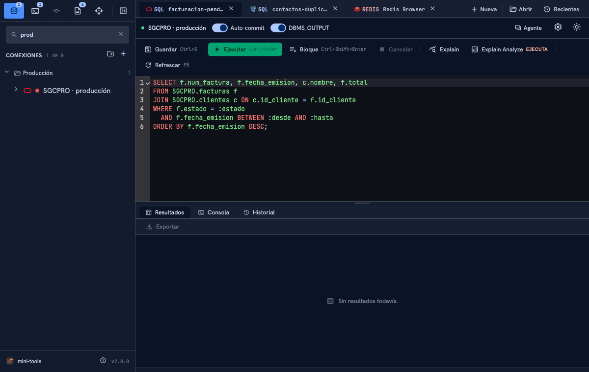
</p>

- **Árbol de conexiones** con buscador que cubre tablas y también procedures/functions/triggers/packages, categoría de tablas colapsable y siempre ordenada alfabéticamente (probado con un schema real de 342 tablas), y export de DDL (objeto puntual o esquema completo) desde el propio árbol.
- **Configuración centralizada**: backup del vault y "recordar clave maestra" viven en un modal de Configuración propio, abierto desde el ícono de engranaje — no sueltos en la barra de herramientas.
- **EXPLAIN PLAN visual**: árbol de plan de ejecución para los 3 motores, con detección de full table scan resaltada.
- **Linter SQL básico**: marca `SELECT *` como sugerencia visual (no bloquea) y `UPDATE`/`DELETE` sin `WHERE` con confirmación antes de ejecutar.
- **Export**: CSV, JSON, XLSX, DDL de tabla/schema completo, y config de conexión (sin password) — más "copiar como INSERT" desde el grid.
- **Tooltips contextuales** en cada control, pensados para alguien que abre la app por primera vez. Toda confirmación (borrar historial, backup del vault) usa un modal propio con el tema de la app, nunca un diálogo nativo del navegador.
- Interfaz Material Design 3, dark/light con toggle persistido, tipografías e íconos empaquetados con la app (sin depender de internet para renderizar).

</details>

## Requisitos

- [Go](https://go.dev/dl/) 1.26 o superior
- [pnpm](https://pnpm.io/) — nunca `npm` ni `yarn`
- Node.js (solo para compilar el frontend; no hay runtime Node en producción)
- [Wails CLI v2](https://wails.io/) (el script de instalación de abajo lo instala si falta)

## Instalación

```bash
git clone https://github.com/rafael180496/mini-tools.git
cd mini-tools
./scripts/install.sh
```

## Comandos

```bash
./scripts/install.sh      # toolchain (Wails CLI si falta) + deps de Go y frontend
./scripts/start-dev.sh    # wails dev — backend Go + frontend Vite con hot reload
./scripts/build.sh        # wails build -clean — build de producción, binario objetivo <80MB
./scripts/start.sh        # corre el binario ya compilado en build/bin/, sin recompilar
./scripts/clean.sh        # borra build/bin + frontend/dist (--all también node_modules y cache de Go)
```

Equivalentes directos, por si hace falta correrlos sin los wrappers:

```bash
wails dev
wails build -clean

cd frontend && pnpm install   # pnpm siempre, nunca npm/yarn
cd frontend && pnpm build

go build ./...
go vet ./...
go test ./...
```

Detalle de cada script en [scripts/README.md](scripts/README.md).

## Empaquetar una versión nueva

```bash
./scripts/bump-version.sh patch   # opcional — bumpea VERSION antes de empaquetar
./scripts/package-all.sh          # empaqueta macOS + Windows juntos (default)
```

`package-all.sh` corre `package-macos.sh` (salteado automáticamente si no
se ejecuta desde macOS) y `package-windows.sh` en una sola pasada. Para
empaquetar un solo SO puntual, correr su script directo — ver el detalle
de cada plataforma abajo.

## Distribución / Empaquetado macOS

```bash
./scripts/bump-version.sh patch   # opcional — bumpea VERSION antes de empaquetar
./scripts/package-macos.sh        # genera build/bin/mini-tools-vX.Y.Z.dmg
```

El `.dmg` resultante **no está firmado** (sin Apple Developer ID ni notarización) — al abrirlo en otra Mac, Gatekeeper va a mostrar "desarrollador no identificado". Workaround: clic derecho sobre la app → Abrir, o `xattr -cr /Applications/mini-tools.app`, o Ajustes del Sistema → Privacidad y Seguridad → Abrir de todas formas.

`package-macos.sh` solo genera el `.dmg` localmente — no crea releases ni sube nada a ningún lado, eso es manual.

### Última versión empaquetada

| Campo | Valor |
|---|---|
| Versión | 2.2.0 |
| Plataforma | macOS — **Apple Silicon (`arm64`) únicamente**, no corre en Mac Intel ni vía Rosetta |
| Compatible desde | macOS 11 (Big Sur) en la práctica — es la primera versión de macOS con hardware Apple Silicon; el `Info.plist` de Wails declara `10.13.0` por plantilla genérica (heredada de cuando también soportaba Intel), no es una garantía real |
| Archivo | **[⬇ Descargar mini-tools-v2.2.0.dmg](https://github.com/rafael180496/mini-tools/releases/download/v2.2.0/mini-tools-v2.2.0.dmg)** |
| SHA-256 | `3e5bb7dc70752ecbab13a284662522324e0e293f98e524611af52c270814601f` |
| Firma | Sin firmar (ver workaround de Gatekeeper arriba) |

## Distribución / Empaquetado Windows

```bash
./scripts/bump-version.sh patch   # opcional — bumpea VERSION antes de empaquetar
./scripts/package-windows.sh      # genera build/bin/mini-tools-vX.Y.Z-windows-amd64.exe
```

Cross-compilado desde macOS/Linux con `wails build -platform windows/amd64` — ninguno de los conectores de base de datos usa CGO, así que no hace falta un toolchain de Windows. **Portable, sin instalador** (no arma NSIS) y **sin firma Authenticode** — SmartScreen va a avisar "Windows protegió su PC" al abrirlo; workaround: "Más información" → "Ejecutar de todas formas".

> ⚠️ **La 2.2.0 NO se probó en una Windows real** — solo se confirmó que cross-compila limpio desde macOS. Que la 2.1.0 se haya verificado en Windows 10 y 11 no dice nada de esta versión, y por eso se anota. Lo nuevo de este lado son las **terminales del sistema operativo**: que el menú liste PowerShell/pwsh/cmd con su ruta real, que ConPTY levante la shell y reflowe bien, y que el historial de esas terminales guarde comandos normales de PowerShell (el filtro de contraseñas se corrigió justamente por eso). Sigue sin verificarse lo que ya venía pendiente: las migraciones del vault —ahora 43 y 44, que crean el historial local y el permiso de escritura del MCP—, el servidor MCP por named pipe (que ahora además escribe), abrir el proyecto en VS Code/Explorador y pegar imágenes en una nota. Detalle en [releases/windows/README.md](releases/windows/README.md).

`package-windows.sh` solo genera el `.exe` localmente — no crea releases ni sube nada a ningún lado, eso es manual.

### Última versión empaquetada

| Campo | Valor |
|---|---|
| Versión | 2.2.0 |
| Plataforma | Windows — **`amd64` (x86-64) únicamente**, cross-compilado desde macOS; esta versión sin probar en Windows real |
| Archivo | **[⬇ Descargar mini-tools-v2.2.0-windows-amd64.exe](https://github.com/rafael180496/mini-tools/releases/download/v2.2.0/mini-tools-v2.2.0-windows-amd64.exe)** |
| SHA-256 | `ea04fcd7125b29c03c4990fca6758c579843cf91cbcfb16c55124c1b76df3cc1` |
| Firma | Sin firmar (SmartScreen va a avisar, ver workaround arriba) |

Detalle completo, checksum de verificación e instrucciones de instalación paso a paso en [releases/windows/README.md](releases/windows/README.md).

## Estructura del proyecto

```text
/backend        crypto (Argon2id + AES-256-GCM), vault (SQLite cifrado columna a columna),
                 conectores de los 6 motores de base de datos (Oracle/PostgreSQL/SQLite/SQL Server/Redis/MongoDB),
                 ejecución de queries (streaming/cancelación), sshconn (sesiones SSH interactivas vía PTY),
                 EXPLAIN PLAN, export, generador de CLAUDE.md
/frontend       React + TypeScript + Vite + Tailwind v4, editor CodeMirror 6, terminal xterm.js
app.go          superficie completa de binding Go ↔ React
main.go         bootstrap de Wails, embed de frontend/dist
```

Detalle completo (stack, estructura fase a fase, contrato de bindings) en [CLAUDE.md](CLAUDE.md) → [.claude/specs/architecture.md](.claude/specs/architecture.md).

## Sobre las capturas de este README

Las imágenes de este archivo **no son de una instalación real**: salen de
`./scripts/uishot.sh`, que monta los componentes en un navegador headless con
datos inventados. No hay rutas, repositorios, hosts ni credenciales de nadie —
no porque se hayan borrado después, sino porque nunca estuvieron ahí. Es
también la razón por la que ninguna está borroneada: no hay nada que tapar.

## Seguridad

- El DSN de cada conexión se cifra con AES-256-GCM antes de guardarse; la clave se deriva de tu clave maestra con Argon2id y nunca se persiste en ningún lado. Para SSH esto incluye el password, la private key completa y su passphrase — mismo tratamiento que el DSN de cualquier otro motor, nunca un campo aparte sin cifrar.
- Sin clave maestra correcta, la app no arranca — no hay bypass, ni siquiera desde las bindings internas.
- El DSN (y las credenciales SSH) nunca llegan al frontend ni se loguean, tampoco en modo debug — "Exportar configuración" redacta password/private key/passphrase antes de escribir el archivo.
- Los backups del vault están atados a la clave maestra: generarlos y restaurarlos piden la clave, verificada contra el propio archivo de backup — no contra la instalación local, porque un backup puede restaurarse en otra máquina.

## Licencia

[MIT](LICENSE)
